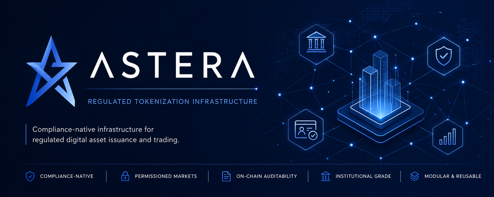
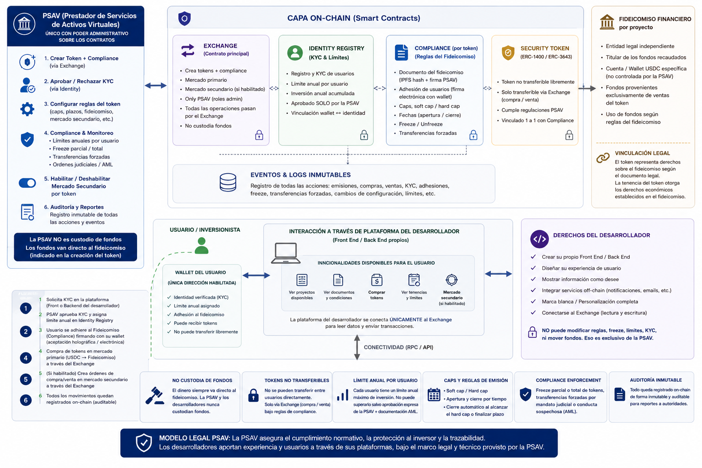

<p align="center">
  
</p>

# Astera Finance

### Regulated Tokenization Infrastructure

White-label infrastructure for regulated real-world asset tokenization platforms.

> Launch compliant tokenized asset marketplaces for PSAVs, regulated issuers, and enterprise platforms.

**Astera is not another token marketplace. It is infrastructure for launching regulated tokenized financial platforms.**

---

## Hackathon Submission — Judge Links

| Resource | Link |
|----------|------|
| Landing | https://comunyt.co/ |
| Live Demo | https://astera-frontend.vercel.app/ |
| Interactive Pitch Deck | [./pitch_slides.html](./pitch_slides.html) |
| Pitch Deck PDF | [./Astera_Pitch_Deck.pdf](./Astera_Pitch_Deck.pdf) |
| Prototype / early contracts proof-of-concept video | https://youtu.be/AKxAs7N9Rr8 |
| Final pitch/demo video | PENDING — replace this line when final video is ready |
| Smart contracts docs | [./contracts/docs/](./contracts/docs/) |
| Address book / deployments | [./contracts/docs/ADDRESS_BOOK.md](./contracts/docs/ADDRESS_BOOK.md) |
| Network | Avalanche C-Chain mainnet |

> The prototype video above is an **early proof of concept** of the contracts and platform flow. It is not the final demo.

### Recommended Judge Walkthrough

1. Watch the prototype video to understand the on-chain flow.
2. Open the landing at https://comunyt.co/ for the institutional overview.
3. Open the live demo at https://astera-frontend.vercel.app/ and explore the regulated marketplace.
4. Review the pitch deck (HTML or PDF) for business model, team, and roadmap.
5. Check deployed contracts and technical documentation in `./contracts/docs/`.

---

## Architecture



Astera separates the regulatory infrastructure layer from the frontend experience, allowing third parties to build compliant financial applications on Astera's rails while the operator retains full control of KYC, compliance, market rules, and audit trails.

---

## Why Astera

- **Compliance-native infrastructure** — compliance rules enforced at the protocol level, not the application layer
- **Permissioned secondary markets** — controlled order book with identity checks, freeze enforcement, and annual investment accounting
- **Identity-aware tokenization** — every operation gated by verified wallet identity and per-project eligibility
- **Non-custodial settlement** — USDC settles directly into the trust/treasury wallet; Astera never custodies user funds
- **Reusable B2B architecture** — deployable for multiple issuers and projects from a single platform instance
- **EIP-712 document evidence** — cryptographic, on-chain audit trail of legal document acceptance
- **On-chain auditability** — immutable event log for every operation: KYC, purchases, transfers, freezes, compliance changes

---

## Enterprise Features

| Feature | Description |
|---------|-------------|
| KYC-aware infrastructure | Global identity registry with per-wallet verification status and annual investment limits |
| Compliance enforcement | Per-project eligibility rules, freeze controls, and transfer validation enforced on-chain |
| Permissioned transfers | Direct ERC20 transfers permanently disabled; all movements require authorized exchange settlement |
| On-chain audit trails | Immutable events for every sensitive operation across identity, compliance, and market layers |
| Role-based access control | Granular roles per contract: identity admin, compliance admin, minter, forced-transfer operator |
| EIP-712 document acceptance | Cryptographic proof of legal document acceptance with document hash and holographic signature hash |
| Secondary market restrictions | Order book restricted to KYC-verified, compliant, non-frozen wallets with partial fill support |
| Non-custodial settlement | Primary and secondary USDC flows go directly to destination wallets; no exchange custody |

---

## Platform Overview

Astera provides reusable infrastructure for regulated tokenized markets under compliant operational frameworks such as PSAVs, trust structures, regulated issuers, and permissioned financial platforms.

The platform separates:
- regulatory enforcement and identity verification,
- compliance and market operations,
- and backend services and document management,

from the frontend experience layer, enabling third parties to build branded compliant financial applications on Astera's infrastructure.

---

## Core Components

### Identity Registry
Maintains verified wallet-to-identity mappings, KYC approval status, and rolling annual investment accounting per wallet.

### Compliance Engine
Enforces per-project transfer restrictions, market eligibility rules, annual limits, full and partial freezes, and permissioned operations.

### Security Tokens
Restricted ERC20 tokens (6 decimals) representing participation rights in tokenized financial instruments. Direct transfers permanently disabled.

### Primary Exchange
Handles compliant issuance and regulated primary purchase flows. USDC goes directly to the project treasury at 1:1 ratio.

### Secondary Exchange
Order-book secondary market operating only after funding completion. Enforces compliance, applies fees, and updates investment accounting atomically.

### Audit & Event Layer
Immutable on-chain event emissions across all contracts for KYC, purchases, orders, compliance changes, and administrative operations.

---

## Backend & Services Layer

The current demo backend runs on **Next.js + Supabase** (see `frontend/app/`). There is no separate standalone backend server in this repository.

The full production backend services specification is documented in [`docs/BACKEND_SERVICES.md`](docs/BACKEND_SERVICES.md).

**Demo (current):** Next.js API routes + Supabase for off-chain data, KYC records, document metadata, and auth.

**Production services (future):** dedicated KYC provider, on-chain event indexer, document storage (IPFS/S3), compliance notification webhooks, and audit log service.

The backend services layer is responsible for:

- **KYC orchestration** — off-chain identity verification integrated with on-chain wallet registration
- **Document management** — PDF generation, IPFS upload, holographic signature capture, and hash calculation
- **Event indexing** — on-chain event ingestion for admin panels, compliance reporting, and audit exports
- **Admin APIs** — KYC registration, project creation, compliance management, and funding lifecycle operations
- **Compliance workflows** — freeze/unfreeze management, forced transfer monitoring, and alert generation
- **Notifications** — webhook delivery for key events: KYC, purchases, funding close, compliance changes
- **Audit logs** — off-chain record of sensitive admin actions paired with on-chain event evidence

---

## Non-Custodial Settlement

USDC settles directly into the trust or treasury wallet defined at project creation.

The primary exchange never holds user funds. The secondary exchange holds USDC transiently during a single transaction execution. No exchange custody at rest.

---

## Reference Implementation

The included marketplace application (`frontend/app/`) is a **reference implementation** showing how a regulated tokenized asset market can be built on Astera.

The reference implementation demonstrates:
- user onboarding and KYC status display,
- EIP-712 document acceptance flow,
- primary purchase with USDC approval,
- secondary order creation, execution, and cancellation,
- portfolio and compliance visibility.

**The product is the infrastructure. The demo is a proof of how it works in practice.**

---

## Landing & App

| Surface | Purpose |
|---------|---------|
| `frontend/landing/` | Institutional and commercial presentation for PSAVs, fintechs, and enterprise operators |
| `frontend/app/` | Functional reference implementation showing a regulated tokenized marketplace built on Astera |

---

## Why Avalanche

Astera is designed for high-performance regulated financial infrastructure. Avalanche is selected for institutional-specific reasons:

- **Fast finality** — settlement completes in seconds, enabling responsive onboarding and purchase UX
- **Low operational cost** — predictable transaction fees at scale for KYC, purchase, and compliance operations
- **EVM compatibility** — full compatibility with existing Solidity tooling, auditing standards, and integrations
- **Institutional ecosystem** — hackathon and partner ecosystem oriented toward institutional financial infrastructure
- **Avalanche L1 readiness** — architecture path toward dedicated, permissioned network environments for regulated operators

Avalanche is not chosen for speed and cost alone. It connects directly to Astera's requirements for settlement finality, compliance UX, secondary market throughput, and the institutional ecosystem in LATAM.

---

## Avalanche L1 Ready

Astera is designed to support future deployment on Avalanche L1 environments for regulated institutions, PSAVs, and enterprise tokenization platforms.

Potential L1 use cases:

- **Permissioned validators** — institution-controlled validator sets for regulated transaction processing
- **Compliance-first settlement** — custom network rules enforcing KYC and compliance at the infrastructure layer
- **Institution-specific environments** — dedicated chains for regulated issuers or multi-issuer platforms
- **Regulated secondary markets** — permissioned trading environments with operator-defined eligibility rules

---

## Powered By

| | |
|--|--|
| **Avalanche C-Chain** | Primary deployment network for regulated tokenized markets in LATAM |
| **USDC (Circle)** | Settlement currency (`0xB97EF9Ef8734C71904D8002F8b6Bc66Dd9c48a6E`) |
| **Wavy Node** | Risk intelligence partner for on-chain traceability and compliance signals |

---

## Future Extensions

- Avalanche L1 deployments for dedicated regulated environments
- Institutional settlement environments with permissioned validator sets
- External AML/risk provider integrations (Wavy Node, Chainalysis)
- Advanced KYC provider integrations (on-chain claim topics, trusted issuers)
- Cross-border regulated market deployments
- Timelock and multisig enforcement for production admin operations
- Automated refund flows for failed funding rounds

---

## Repository Structure

```txt
frontend/     Landing (institutional) + App (reference implementation — Next.js + Supabase)
contracts/    Smart contracts and protocol logic (Foundry — source of truth for all contracts)
docs/         Technical documentation, audit materials, architecture, backend services spec
assets/       Architecture diagrams, branding, visual assets
SUBMISSION.md Hackathon submission summary with all links and feature overview
```

> `frontend/app/` uses Scaffold-ETH 2 tooling for wallet/web3 UX. The smart contract source of truth is `/contracts` (Foundry). The Hardhat package in `frontend/app/packages/hardhat/` is retained for Scaffold-ETH dev tooling only and is not the source of the deployed contracts.

---

## Core Principles

- Compliance-native architecture
- Non-custodial operational model
- Permissioned market infrastructure
- Modular smart contract system
- On-chain auditability
- Institutional-first design
- Reusable infrastructure layer

---

## Current Status

Smart contracts: production-ready architecture deployed on Avalanche C-Chain. 73 tests passing across unit, integration, and fork test suites.

Platform: reference implementation and infrastructure prototype for regulated tokenized market operations.

---

## Disclaimer

This repository is provided for research, experimentation, and demonstration purposes only.

Nothing contained in this repository constitutes legal, financial, or investment advice.

Regulatory compliance requirements may vary depending on jurisdiction and implementation context.

---

## License

All rights reserved.
